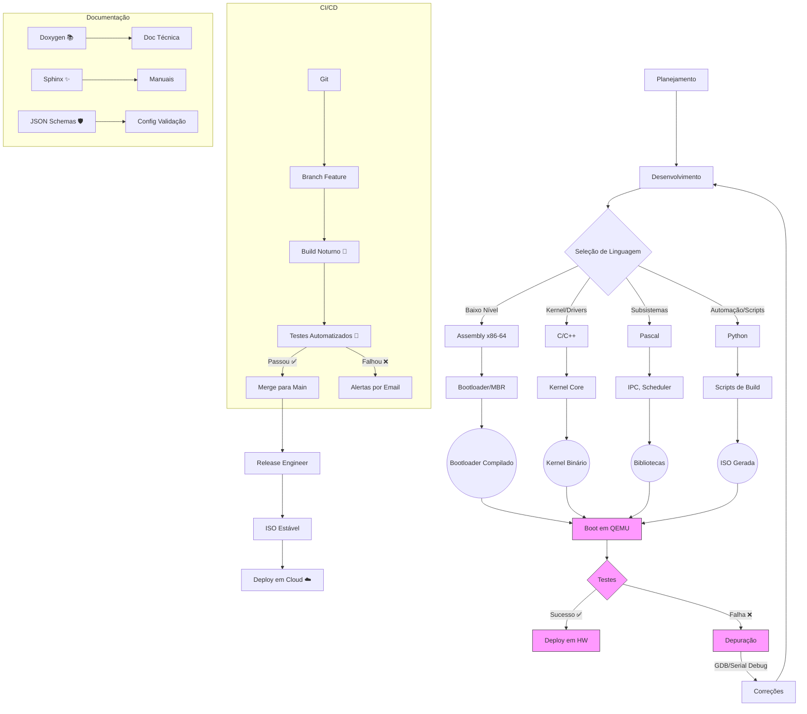

# 🚀 PandaOS Documentation

> **PandaOS** é um sistema operacional **100% from-scratch** focado em modularidade, desempenho e flexibilidade. Este repositório documenta a arquitetura completa, os fluxos de trabalho e os componentes essenciais, desde o bootloader até o kernel, drivers, e ferramentas de build e testes.

---

## 📑 Sumário

- [Introdução](#introdução-)
- [Estrutura de Diretórios](#estrutura-de-diretórios-)
- [Fluxo de Trabalho e CI/CD](#fluxo-de-trabalho-e-cicd-)
- [O Bootloader Principal](#o-bootloader-principal-)
- [Kernel e Subsistemas](#kernel-e-subsistemas-)
- [Drivers e Bibliotecas](#drivers-e-bibliotecas-)
- [Sistema de Build e Testes](#sistema-de-build-e-testes-)
- [Considerações de Segurança e Futuras Melhorias](#considerações-de-segurança-e-futuras-melhorias-)
- [Fluxo de Trabalho em Mermaid](#fluxo-de-trabalho-em-mermaid-)
- [Considerações Finais](#considerações-finais-)

---
# ✨ Showcase Video
> _**Ainda não Disponivel**_

# ⚠️ Important
O PandaOS só funcionará no QEMU, para que possa ter operações e funções mais fáceis e legíveis.

## ✨ Introdução

O **PandaOS** é um sistema operacional desenvolvido do zero, projetado para ambientes **x86-64**. O projeto é **multilíngue** e utiliza:

- **Assembly (x86-64)** para operações de baixo nível 🚀
- **C/C++** para o kernel core e drivers de alta performance 💻
- **Pascal** para subsistemas críticos como o escalonador e IPC 🔧
- **Python** para scripts de automação e orquestração 🐍

Essa abordagem híbrida permite um controle preciso dos recursos do sistema, garantindo performance e segurança.

---

## 📂 Estrutura de Diretórios

A seguir, a árvore de diretórios do PandaOS, com descrições de cada componente:

```plaintext
/PandaOS
├── /boot
│   ├── mbr/
│   │   ├── mbr.asm                # Master Boot Record (x86-64 ASM)
│   │   └── partition_table.asm    # Tabela de partições primária
│   ├── bootloader/
│   │   ├── stage1.asm             # Bootloader estágio 1 (BIOS)
│   │   ├── stage2.c               # Bootloader estágio 2 (Modo protegido)
│   │   └── stage3.cpp             # Bootloader estágio 3 (Modo longo 64-bit)
│   └── config/
│       ├── boot.json              # Parâmetros de boot (ex: timeout, kernel path)
│       └── hardware_detect.json   # Configuração inicial de hardware
├── /kernel
│   ├── arch/
│   │   └── x86_64/
│   │       ├── entry.asm          # Entry point do kernel (ASM)
│   │       ├── gdt.asm            # Global Descriptor Table
│   │       ├── idt.asm            # Interrupt Descriptor Table
│   │       └── apic/              # Driver APIC (Advanced Programmable Interrupt Controller)
│   ├── core/
│   │   ├── kmain.cpp              # Ponto principal do kernel (C++)
│   │   ├── memory/
│   │   │   ├── pmm.c              # Physical Memory Manager (C)
│   │   │   └── vmm.cpp            # Virtual Memory Manager (C++)
│   │   ├── process/
│   │   │   ├── scheduler.pas      # Escalonador de processos (Pascal)
│   │   │   └── threads.c          # Gerenciamento de threads
│   │   ├── syscalls/
│   │   │   ├── syscalls.asm       # Syscalls de baixo nível (ASM)
│   │   │   └── syscalls_api.c     # API de syscalls para userland
│   │   └── fs/
│   │       ├── panda_fs.cpp       # Sistema de arquivos customizado
│   │       └── vfs.c              # Virtual File System
├── /drivers
│   ├── storage/
│   │   ├── ata.cpp                # Driver ATA (C++)
│   │   ├── nvme.asm               # Driver NVMe (ASM para performance)
│   │   └── fs_drivers/
│   │       ├── ext4.c             # Driver para sistemas externos (ex: EXT4)
│   │       └── fat32.pas          # Driver FAT32 (Pascal)
│   ├── video/
│   │   ├── vga.c                  # Driver VGA básico
│   │   ├── framebuffer.cpp        # Driver para framebuffer
│   │   └── gpu/
│   │       ├── nvidia.c           # Driver para GPUs NVIDIA
│   │       └── amd.asm            # Otimizações para AMD em ASM
│   ├── input/
│   │   ├── keyboard.c             # Driver de teclado (PS/2)
│   │   ├── mouse.cpp              # Driver de mouse
│   │   └── usb/
│   │       ├── usb_core.pas       # Core USB em Pascal
│   │       └── usb_hid.c          # Dispositivos HID USB
│   └── pci/
│       ├── pci_enum.c             # Enumeração de dispositivos PCI
│       └── pci_devices.json       # Database de IDs PCI
├── /lib
│   ├── libc/
│   │   ├── stdio.c                # printf, scanf, etc.
│   │   ├── stdlib.cpp             # malloc, free (C++)
│   │   └── math.pas               # Funções matemáticas (Pascal)
│   ├── libpanda/
│   │   ├── graphics.py           # Helpers gráficos em Python
│   │   └── sysutils.pas           # Utilitários de sistema em Pascal
│   └── firmware/
│       └── uefi/                  # Firmware UEFI (se aplicável)
├── /userland
│   ├── init/
│   │   └── init.c                # Processo init (primeiro processo userspace)
│   ├── shell/
│   │   ├── shell.cpp             # Shell principal (C++)
│   │   └── scripts/
│   │       ├── network.py        # Scripts de rede em Python
│   │       └── utils.pas         # Utilitários em Pascal
│   └── gui/
│       ├── window_manager.cpp    # Gerenciador de janelas
│       └── themes/
│           ├── default.json      # Tema padrão (JSON)
│           └── icons/
├── /config
│   ├── system/
│   │   ├── sysconfig.json        # Configuração do sistema
│   │   └── network.json          # Configurações de rede
│   └── users/
│       ├── root.json             # Configurações do root
│       └── permissions.pas       # Gerenciamento de permissões
├── /build
│   ├── toolchain/
│   │   ├── cross-compiler/       # Compilador cruzado x86_64-panda
│   │   └── linker_scripts/       # Scripts de linker para o kernel
│   ├── iso/                      # ISO gerada
│   └── logs/                     # Logs de compilação
├── /tests
│   ├── unit/
│   │   ├── memory_tests.c        # Testes de memória
│   │   └── syscall_tests.pas     # Testes de syscall em Pascal
│   ├── integration/
│   │   ├── hardware_tests.py     # Testes de hardware com Python
│   │   └── stress_tests.cpp      # Testes de estresse
│   └── qemu/                     # Configs para emulação
├── /docs
│   ├── specs/                    # Especificações técnicas
│   ├── man/                      # Manuais
│   └── api/                      # Documentação da API
└── /scripts
    ├── build.py                  # Script de build principal (Python)
    ├── deploy.sh                 # Deploy em hardware real
    └── tools/
        ├── partition_manager.pas # Gerenciador de partições
        └── kernel_debugger.cpp   # Debugger do kernel
```

Cada diretório foi estruturado para manter a **clareza** e a **modularidade** do projeto, facilitando a manutenção e a expansão contínua do sistema.

---

## 🔄 Fluxo de Trabalho e CI/CD

O desenvolvimento do PandaOS segue um fluxo de trabalho rigoroso, integrando práticas de CI/CD para garantir estabilidade e qualidade. Veja como o processo se desenvolve:



Esse diagrama detalha as etapas desde o planejamento, desenvolvimento, seleção de linguagens, build, testes e até o deploy, com um fluxo contínuo de integração e entrega.

---

## 🔧 O Bootloader Principal

O bootloader é a primeira etapa de inicialização e é dividido em **três estágios** para contornar as limitações do ambiente de boot e preparar o sistema para o kernel em 64-bit:

### Fases do Bootloader

1. **Stage 1 (BIOS – Modo Real)**  
   - **Função:** Inicializa o sistema e prepara a transição para o modo protegido.  
   - **Implementação:** Em Assembly x86-64 (`mbr.asm`) 🚀

2. **Stage 2 (Modo Protegido 32-bit)**  
   - **Função:** Configura hardware básico e gerencia a memória.  
   - **Implementação:** Em C (`stage2.c`) 💻

3. **Stage 3 (Modo Longo 64-bit)**  
   - **Função:** Configura o ambiente de execução em 64-bit e transfere o controle para o kernel.  
   - **Implementação:** Em C++ (`stage3.cpp`) 🔧

### Exemplo de Código do Bootloader

```asm
[org 0x7C00]
[bits 16]

start:
    ; Configuração inicial
    cli
    xor ax, ax
    mov ds, ax
    mov es, ax
    mov ss, ax
    mov sp, 0x7C00
    sti

    ; Modo de vídeo 80x25
    mov ax, 0x0003
    int 0x10

    ; Mostrar tela de carregamento
    call show_loading_screen
    call show_system_info

    ; Esperar pressionar tecla
    xor ax, ax
    int 0x16

    ; Mostrar informações do criador
    call show_creator_info

    ; Esperar pressionar tecla novamente
    xor ax, ax
    int 0x16

    ; Carregar kernel
    jmp load_kernel

; Funções de exibição e carregamento abaixo...
```

**Detalhes Importantes:**

- **Inicialização:** Configuração dos registradores e da pilha para garantir uma transição suave.
- **Modo de Vídeo:** Configuração do modo 80x25 para saída em texto.
- **Exibição:** Funções como `show_loading_screen` e `show_system_info` utilizam interrupções BIOS para exibir informações importantes.
- **Carregamento do Kernel:** Uso da interrupção `int 0x13` para ler setores do disco e transferir a execução ao kernel.

---

## ⚙️ Kernel e Subsistemas

Após o bootloader, o controle passa para o kernel, composto por diversos módulos críticos:

- **Entry Point e Inicialização:**  
  Arquivos em `arch/x86_64/` (ex.: `entry.asm`, `gdt.asm`, `idt.asm`) preparam o ambiente para o modo 64-bit.

- **Gerenciamento de Memória:**  
  Implementado por `pmm.c` (Physical Memory Manager) e `vmm.cpp` (Virtual Memory Manager).

- **Processos e Threads:**  
  O escalonador (`scheduler.pas`) e o gerenciamento de threads (`threads.c`) coordenam a execução paralela dos processos.

- **Syscalls:**  
  Implementadas em `syscalls.asm` e expostas em `syscalls_api.c`, permitindo a comunicação segura entre userland e kernel.

- **Sistema de Arquivos:**  
  Composto pelo `panda_fs.cpp` e `vfs.c`, garantindo organização e acesso aos dados.

---

## 🛠️ Drivers e Bibliotecas

Os drivers são desenvolvidos com foco em performance e compatibilidade:

- **Storage:**  
  Drivers ATA (`ata.cpp`) e NVMe (`nvme.asm`), além dos adaptadores para EXT4 e FAT32.

- **Vídeo e Interface:**  
  Drivers VGA, framebuffer e suporte a GPUs NVIDIA e AMD.

- **Entrada:**  
  Drivers para teclado, mouse e dispositivos USB (com implementações em Pascal e C).

- **Bibliotecas:**  
  A **libc** oferece funções padrão (como `printf` e `malloc`), enquanto o `libpanda` e outros utilitários em Python e Pascal suportam operações gráficas e de sistema.

---

## 📦 Sistema de Build e Testes

Para garantir a qualidade e integridade do PandaOS, adotamos:

- **Toolchain Personalizada:**  
  Compilador cruzado e scripts de linker (localizados em `/build/toolchain`).

- **ISO Gerada e Logs:**  
  A pasta `/build` armazena a ISO final e os logs de compilação.

- **Testes Abrangentes:**  
  Testes unitários, de integração e de estresse utilizando C, Pascal, Python e emulação via QEMU.

- **CI/CD Automatizada:**  
  Pipeline que inclui builds noturnos, testes automatizados e deploy controlado (com alertas e merges via Git).

---

## 🔒 Considerações de Segurança e Futuras Melhorias

- **Isolamento de Memória:**  
  Implementação de paginação de 4 níveis para garantir a integridade dos processos.

- **Sandboxing e Capabilities:**  
  Aplicações em userland são executadas em ambientes restritos, definidos por configurações JSON.

- **Modularidade:**  
  A estrutura permite a integração de novos módulos e drivers sem comprometer o sistema já consolidado.

---

## 🌐 Fluxo de Trabalho em Mermaid

O diagrama abaixo resume o fluxo de desenvolvimento e deploy do PandaOS:


---

# 🛠️ Current Progress
- ✅ **VBE Support (640x480 8bpp)**
- ✅ **Global Descriptor Table (GDT)**
- ❌ **Entering Protected Mode**
- ✅ **Fonts and Print Functions**
- ✅ **Interrupts (IDT, ISR, IRQ)**
- ✅ **Keyboard Driver**
- ✅ **Mouse Driver**
- ✅ **Memory Management**
- ✅ **File System**
- ✅ **Shell**
- ❌ **Graphical Interface (GUI)**
- ✅ **ELF Loader**
- ❌ **Task State Segment (TSS)**
- ❌ **Network Driver**
- ❌ **Audio Driver**
- ❌ **Processes**
- ❌ **Multitasking**
- ❌ **Installation Setup**
- ❌ **User Documentation**

---

## 💡 Considerações Finais

O PandaOS é um projeto ambicioso que une o melhor das linguagens e paradigmas para criar um sistema operacional robusto, seguro e modular.  
Este repositório serve como referência técnica e guia para desenvolvedores que desejam entender, contribuir e expandir o sistema.

> **Nota:** Este documento será continuamente atualizado à medida que novas funcionalidades forem integradas. Mantenha-se conectado para acompanhar as evoluções do PandaOS! 🔄

---

Sinta-se à vontade para contribuir, reportar issues ou enviar pull requests para ajudar a melhorar este projeto.  
**Happy Coding!** 👨‍💻👩‍💻

---
