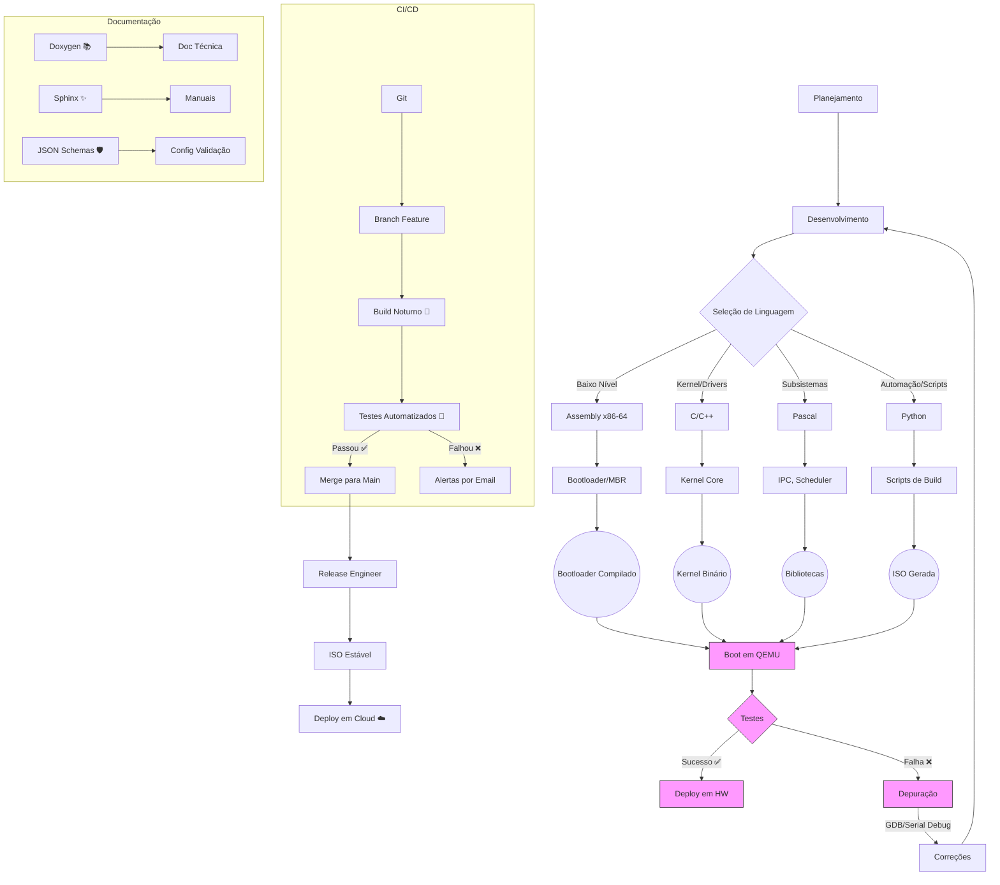

# 🐼 PandaOS — Sistema Operacional x86 em Modo Protegido
<p align="center">
  
  <a href="https://github.com/panda12332145/PandaOS/commits/main"></a>
  <a href="https://github.com/panda12332145/PandaOS"></a>
  
  
</p>
---
## 🔖 Resumo

Sistema operacional x86 escrito do zero em **Assembly**, construído para rodar em **modo protegido/long mode**, com bootloader por fases, kernel e subsistemas, drivers, bibliotecas e pipeline de build/testes documentado — incluindo vídeo de showcase e progresso atual.

### ✨ Funcionalidades Principais

- ✅ Bootloader multfase documentado (Real → Protegido → Long)
- ✅ Kernel e subsistemas organizados
- ✅ Drivers e bibliotecas próprias
- ✅ Sistema de build e testes
- ✅ CI/CD e fluxo de trabalho documentados
- ✅ Vídeo de showcase no README

## 📽 Demonstração

```text
$ make run
Booting PandaOS...
[Real Mode] → [Protected Mode] → [Long Mode]
> menu principal do PandaOS

🎬 Showcase: vídeo no GitHub
```

## ⚙️ Explicação das Partes Importantes

### Fases do bootloader

```asm
; Fases do Bootloader:
; 1. Real Mode     — POST, carregamento do setor
; 2. Protected Mode — GDT, habilitação de segmentos
; 3. Long Mode      — paging 64-bit, salto para o kernel
```

> A sequência clássica de todo OS x86 from scratch — cada fase tem seu arquivo e comentários no código.

### Contato embutido no boot

```asm
con_msg03 db 0x08, ' YouTube: @X86BinaryGhost', 0
con_msg04 db 0x02, ' Email: athos.cybersec@gmail.com', 0
con_msg05 db ' GitHub: panda12332145', 0x03, 0
```

> Mensagens de créditos exibidas na tela de boot (e-mail do autor — corrigido nesta auditoria).

##✨ Showcase Video

> _**Ainda não Disponivel**_

---

##⚠️ Important

O PandaOS só funcionará no QEMU, para que possa ter operações e funções mais fáceis e legíveis.

---

###✨ Introdução

O **PandaOS** é um sistema operacional desenvolvido do zero, projetado para ambientes **x86-64**. O projeto é **multilíngue** e utiliza:

- **Assembly (x86-64)** para operações de baixo nível 🚀
- **C/C++** para o kernel core e drivers de alta performance 💻
- **Pascal** para subsistemas críticos como o escalonador e IPC 🔧
- **Python** para scripts de automação e orquestração 🐍

Essa abordagem híbrida permite um controle preciso dos recursos do sistema, garantindo performance e segurança.

---

---

###🔄 Fluxo de Trabalho e CI/CD

O desenvolvimento do PandaOS segue um fluxo de trabalho rigoroso, integrando práticas de CI/CD para garantir estabilidade e qualidade. Veja como o processo se desenvolve:


```mermaid
graph TD
    A[Planejamento] --> B[Desenvolvimento]
    B --> C{Seleção de Linguagem}
    C -->|Baixo Nível| D[Assembly x86-64]
    C -->|Kernel/Drivers| E[C/C++]
    C -->|Subsistemas| F[Pascal]
    C -->|Automação/Scripts| G[Python]
    
    D --> H[Bootloader/MBR]
    E --> I[Kernel Core]
    F --> J[IPC, Scheduler]
    G --> K[Scripts de Build]
    
    H --> L((Bootloader Compilado))
    I --> M((Kernel Binário))
    J --> N((Bibliotecas))
    K --> O((ISO Gerada))
    
    L --> P[Boot em QEMU]
    M --> P
    N --> P
    O --> P
    
    P --> Q{Testes}
    Q -->|Sucesso ✅| R[Deploy em HW]
    Q -->|Falha ❌| S[Depuração]
    S -->|GDB/Serial Debug| T[Correções]
    T --> B
    
    subgraph CI/CD
        U[Git] --> V[Branch Feature]
        V --> W[Build Noturno 🌙]
        W --> X[Testes Automatizados 🤖]
        X -->|Passou ✅| Y[Merge para Main]
        X -->|Falhou ❌| Z[Alertas por Email]
    end
    
    subgraph Documentação
        A2[Doxygen 📚] --> B2[Doc Técnica]
        C2[Sphinx ✨] --> D2[Manuais]
        E2[JSON Schemas 🛡️] --> F2[Config Validação]
    end
    
    Y --> AA[Release Engineer]
    AA --> AB[ISO Estável]
    AB --> AC[Deploy em Cloud ☁️]
    
    classDef focus fill:#f9f,stroke:#333;
    class P,Q,R,S focus;
```

Esse diagrama detalha as etapas desde o planejamento, desenvolvimento, seleção de linguagens, build, testes e até o deploy, com um fluxo contínuo de integração e entrega.

---

---

###🔧 O Bootloader Principal

O bootloader é a primeira etapa de inicialização e é dividido em **três estágios** para contornar as limitações do ambiente de boot e preparar o sistema para o kernel em 64-bit:

---

####Fases do Bootloader

1. **Stage 1 (BIOS – Modo Real)**  
   - **Função:** Inicializa o sistema e prepara a transição para o modo protegido.  
   - **Implementação:** Em Assembly x86-64 (`mbr.asm`) 🚀

2. **Stage 2 (Modo Protegido 32-bit)**  
   - **Função:** Configura hardware básico e gerencia a memória.  
   - **Implementação:** Em C (`stage2.c`) 💻

3. **Stage 3 (Modo Longo 64-bit)**  
   - **Função:** Configura o ambiente de execução em 64-bit e transfere o controle para o kernel.  
   - **Implementação:** Em C++ (`stage3.cpp`) 🔧

---

####Exemplo de Código do Bootloader

```asm
[org 0x7C00]
[bits 16]

start:
    ; Configuração inicial
    cli
    xor ax, ax
    mov ds, ax
    mov es, ax
    mov ss, ax
    mov sp, 0x7C00
    sti

    ; Modo de vídeo 80x25
    mov ax, 0x0003
    int 0x10

    ; Mostrar tela de carregamento
    call show_loading_screen
    call show_system_info

    ; Esperar pressionar tecla
    xor ax, ax
    int 0x16

    ; Mostrar informações do criador
    call show_creator_info

    ; Esperar pressionar tecla novamente
    xor ax, ax
    int 0x16

    ; Carregar kernel
    jmp load_kernel

; Funções de exibição e carregamento abaixo...
```

**Detalhes Importantes:**

- **Inicialização:** Configuração dos registradores e da pilha para garantir uma transição suave.
- **Modo de Vídeo:** Configuração do modo 80x25 para saída em texto.
- **Exibição:** Funções como `show_loading_screen` e `show_system_info` utilizam interrupções BIOS para exibir informações importantes.
- **Carregamento do Kernel:** Uso da interrupção `int 0x13` para ler setores do disco e transferir a execução ao kernel.

---

---

###⚙️ Kernel e Subsistemas

Após o bootloader, o controle passa para o kernel, composto por diversos módulos críticos:

- **Entry Point e Inicialização:**  
  Arquivos em `arch/x86_64/` (ex.: `entry.asm`, `gdt.asm`, `idt.asm`) preparam o ambiente para o modo 64-bit.

- **Gerenciamento de Memória:**  
  Implementado por `pmm.c` (Physical Memory Manager) e `vmm.cpp` (Virtual Memory Manager).

- **Processos e Threads:**  
  O escalonador (`scheduler.pas`) e o gerenciamento de threads (`threads.c`) coordenam a execução paralela dos processos.

- **Syscalls:**  
  Implementadas em `syscalls.asm` e expostas em `syscalls_api.c`, permitindo a comunicação segura entre userland e kernel.

- **Sistema de Arquivos:**  
  Composto pelo `panda_fs.cpp` e `vfs.c`, garantindo organização e acesso aos dados.

---

---

###🛠️ Drivers e Bibliotecas

Os drivers são desenvolvidos com foco em performance e compatibilidade:

- **Storage:**  
  Drivers ATA (`ata.cpp`) e NVMe (`nvme.asm`), além dos adaptadores para EXT4 e FAT32.

- **Vídeo e Interface:**  
  Drivers VGA, framebuffer e suporte a GPUs NVIDIA e AMD.

- **Entrada:**  
  Drivers para teclado, mouse e dispositivos USB (com implementações em Pascal e C).

- **Bibliotecas:**  
  A **libc** oferece funções padrão (como `printf` e `malloc`), enquanto o `libpanda` e outros utilitários em Python e Pascal suportam operações gráficas e de sistema.

---

---

###📦 Sistema de Build e Testes

Para garantir a qualidade e integridade do PandaOS, adotamos:

- **Toolchain Personalizada:**  
  Compilador cruzado e scripts de linker (localizados em `/build/toolchain`).

- **ISO Gerada e Logs:**  
  A pasta `/build` armazena a ISO final e os logs de compilação.

- **Testes Abrangentes:**  
  Testes unitários, de integração e de estresse utilizando C, Pascal, Python e emulação via QEMU.

- **CI/CD Automatizada:**  
  Pipeline que inclui builds noturnos, testes automatizados e deploy controlado (com alertas e merges via Git).

---

---

###🔒 Considerações de Segurança e Futuras Melhorias

- **Isolamento de Memória:**  
  Implementação de paginação de 4 níveis para garantir a integridade dos processos.

- **Sandboxing e Capabilities:**  
  Aplicações em userland são executadas em ambientes restritos, definidos por configurações JSON.

- **Modularidade:**  
  A estrutura permite a integração de novos módulos e drivers sem comprometer o sistema já consolidado.

---

---

###🌐 Fluxo de Trabalho em Mermaid

O diagrama abaixo resume o fluxo de desenvolvimento e deploy do PandaOS:


```mermaid
graph TD
    A[Planejamento] --> B[Desenvolvimento]
    B --> C{Seleção de Linguagem}
    C -->|Baixo Nível| D[Assembly x86-64]
    C -->|Kernel/Drivers| E[C/C++]
    C -->|Subsistemas| F[Pascal]
    C -->|Automação/Scripts| G[Python]
    
    D --> H[Bootloader/MBR]
    E --> I[Kernel Core]
    F --> J[IPC, Scheduler]
    G --> K[Scripts de Build]
    
    H --> L((Bootloader Compilado))
    I --> M((Kernel Binário))
    J --> N((Bibliotecas))
    K --> O((ISO Gerada))
    
    L --> P[Boot em QEMU]
    M --> P
    N --> P
    O --> P
    
    P --> Q{Testes}
    Q -->|Sucesso ✅| R[Deploy em HW]
    Q -->|Falha ❌| S[Depuração]
    S -->|GDB/Serial Debug| T[Correções]
    T --> B
    
    subgraph CI/CD
        U[Git] --> V[Branch Feature]
        V --> W[Build Noturno 🌙]
        W --> X[Testes Automatizados 🤖]
        X -->|Passou ✅| Y[Merge para Main]
        X -->|Falhou ❌| Z[Alertas por Email]
    end
    
    subgraph Documentação
        A2[Doxygen 📚] --> B2[Doc Técnica]
        C2[Sphinx ✨] --> D2[Manuais]
        E2[JSON Schemas 🛡️] --> F2[Config Validação]
    end
    
    Y --> AA[Release Engineer]
    AA --> AB[ISO Estável]
    AB --> AC[Deploy em Cloud ☁️]
    
    classDef focus fill:#f9f,stroke:#333;
    class P,Q,R,S focus;
```
---

---

##🛠️ Current Progress

- ✅ **VBE Support (640x480 8bpp)**
- ✅ **Global Descriptor Table (GDT)**
- ❌ **Entering Protected Mode**
- ✅ **Fonts and Print Functions**
- ✅ **Interrupts (IDT, ISR, IRQ)**
- ✅ **Keyboard Driver**
- ✅ **Mouse Driver**
- ✅ **Memory Management**
- ✅ **File System**
- ✅ **Shell**
- ❌ **Graphical Interface (GUI)**
- ✅ **ELF Loader**
- ❌ **Task State Segment (TSS)**
- ❌ **Network Driver**
- ❌ **Audio Driver**
- ❌ **Processes**
- ❌ **Multitasking**
- ❌ **Installation Setup**
- ❌ **User Documentation**

---

## 📂 Estrutura do Projeto

```plaintext
PandaOS/
├── PandaOS/
│   ├── boot/bootloader/    # bootloader.asm (fases + mensagens)
│   ├── kernel/             # núcleo e subsistemas
│   ├── drivers/            # drivers e bibliotecas
│   └── build/              # artefatos
├── LICENSE
└── README.md               # Documentação completa
```

## 🛠️ Tecnologias

| Ferramenta | Uso |
|---|---|
| **Assembly x86** | Bootloader e kernel |
| **QEMU/VirtualBox** | Execução e teste |
| **Make** | Build system |

## ▶️ Instalação

```bash
git clone https://github.com/panda12332145/PandaOS.git
cd PandaOS
# montagem/chainloading conforme docs do repo
```

## 🚀 Execução

```bash
# execute em um emulador (QEMU):
qemu-system-i386 -drive format=raw,file=SEU_IMAGEM.img
# ougrave em mídia física por sua conta e risco
```

## 🧪 Testes

Build + boot no emulador; progresso atual no README original (seção Current Progress).

## ⚠️ Limitações

- Em desenvolvimento ativo
- Sem syscalls completas de usuário
- Imagens commitadas podem estar defasadas vs código

## 🚀 Roadmap

- [ ] Completar modo long mode
- [ ] Syscalls de usuário
- [ ] Sistema de arquivos
- [ ] CI de build

## 📄 Licença

Distribuído sob a licença do arquivo [`LICENSE`](LICENSE).

---

## 👾 Autor

<p align="center">
  
</p>

<p align="center">Feito por <strong>Panda12332145</strong> 👋🏽</p>

---

## 🧑‍💻 Sobre Mim

Sou apaixonado por **Física Teórica, Cibersegurança e Desenvolvimento de Sistemas**. Tenho grande interesse em programação de baixo nível, engenharia reversa, automação, sistemas Windows, criptografia e segurança ofensiva. Também gosto bastante de música, filosofia e computação avançada.

---

## 🌐 Redes

* **Site:** [https://panda-h0me.netlify.app/](https://panda-h0me.netlify.app/)
* **YouTube:** [https://www.youtube.com/@X86BinaryGhost](https://www.youtube.com/@X86BinaryGhost)
* **Instagram:** [https://www.instagram.com/01pandal10/](https://www.instagram.com/01pandal10/)
* **GitHub:** [https://github.com/panda12332145](https://github.com/panda12332145)
* **LinkedIn:** [linkedin.com/in/athos-da-boanergis](https://www.linkedin.com/in/athos-d%C3%A3-boanergis-5585a4288/)

---

## 🚀 Áreas de Interesse

* **Cibersegurança Avançada** 🔒
* **Hacking & Engenharia Reversa** 💻
* **Computação de Baixo Nível** 🖥️
* **Matemática e Física Teórica** 📐⚛️
* **Desenvolvimento de Ferramentas de Segurança** 🛠️

_"Conhecimento é poder, e domínio técnico vem da compreensão profunda dos sistemas."_

---

## 📞 Contato & Suporte

Para colaborações, dúvidas ou sugestões:

📧 **E-mail:** [athos.cybersec@gmail.com](mailto:athos.cybersec@gmail.com)

🐛 **Reportar Bug:** [Abrir Issue](https://github.com/panda12332145/PandaOS/issues)

💡 **Sugerir Melhoria:** [Discussions](https://github.com/panda12332145/PandaOS/discussions)
